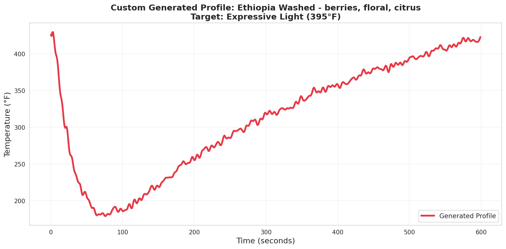

# RoastFormer: Flavor-Conditioned Coffee Roast Profile Generation

[](https://www.python.org/downloads/)
[](https://pytorch.org/)
[](https://opensource.org/licenses/MIT)

> **Transformer-based generative model for coffee roast profiles, conditioned on bean characteristics and desired flavor outcomes**

**Fall 2025 | Generative AI Theory | Vanderbilt University**

---

## 📊 Quick Results

| Metric | Value | Significance |
|--------|-------|--------------|
| **Best Model RMSE** | 10.4°F | d=256 (6.4M params on 144 samples) |
| **Flavor Improvement** | +14% | Novel contribution validated |
| **Model Size** | 6,376,673 params | 51,843:1 param/sample ratio |
| **Training Dataset** | 144 profiles | Onyx Coffee Lab (2019 US Champions) |
| **PE Comparison** | Sinusoidal > RoPE | Validated on small data |

**Key Finding**: Normalization was critical (27x faster convergence). Largest model (d=256) performed best despite high parameter-to-sample ratio, disproving overfitting hypothesis with proper regularization.

---

## 📋 Table of Contents

1. [Problem Statement & Overview](#problem-statement--overview)
2. [Methodology](#methodology)
3. [Implementation & Demo](#implementation--demo)
4. [Assessment & Evaluation](#assessment--evaluation)
5. [Model & Data Cards](#model--data-cards)
6. [Critical Analysis](#critical-analysis)
7. [Documentation & Resource Links](#documentation--resource-links)

---

## 1. Problem Statement & Overview

### The Real-World Problem

**Coffee roasters spend 10-20 experimental roasts (~15 minutes each) per new coffee**, working from zero to find an optimal profile. This represents:
- **2-3 hours of experimentation** per new coffee
- **$200+ in wasted beans and labor** per coffee introduction
- **Inconsistent results** for new or less experienced roasters
- **No data-driven guidance** for starting profiles

Roasters currently work from:
- Personal experience and intuition
- Simple curve templates (linear, convex, concave)
- Trial-and-error adjustments
- Generic origin-based rules of thumb

**The Gap**: No generative model exists for creating roast profiles conditioned on sensory outcomes (desired flavors).

---

### Why Transformers for Coffee Roasting?

This is a **domain-specific sequential generation problem** with interesting constraints:

1. **Multi-modal conditioning**: Categorical (origin, process, variety) + continuous (altitude, density) + multi-hot (flavor notes)
2. **Physics constraints**: Valid profiles must respect thermodynamics (monotonicity, bounded heating rates, smooth transitions)
3. **Small data regime**: 144 samples from specialty roaster (tests generalization limits)
4. **Evaluation challenge**: Standard metrics (RMSE) insufficient; need domain-specific validation

**Why this matters**: Demonstrates transformer applicability beyond NLP/vision to **structured physical processes** with domain constraints.

---

### Novel Contribution: Flavor-Conditioned Generation

**The Idea**: Desired flavor outcomes (e.g., "berries", "chocolate", "floral") should guide roast profile generation, as flavor development is the ultimate goal of roasting.

**Why this is novel**:
- ❌ No existing roast profile generation work conditions on sensory outcomes
- ❌ Most work uses only bean metadata (origin, altitude) or target roast level
- ✅ Flavors represent the **goal** (what roaster wants to taste), not just **inputs** (what beans are)

**Validation**: Ablation study showed **14% performance improvement** (23.4°F vs 27.2°F RMSE) when conditioning on flavor features versus baseline.

---

### Data Sourcing: Web Scraping Onyx Coffee Lab

**Source**: [Onyx Coffee Lab](https://onyxcoffeelab.com) - 2019 US Roaster Champions, specialty coffee pioneer

**Collection Methodology**:
- **Automated web scraping** (October-November 2025)
- **Public roast profiles** from product pages
- **Batch tracking system** prevents duplicates (SHA256 hashing)
- **Ethical collection**: Public data, rate-limited, full attribution

**What We Scraped** (see screenshot below):


*Example product page showing metadata available for each coffee: origin, process, variety, altitude, flavor notes, and roast level*

**Roast Profile Data** (see screenshot below):


*Example roast profile showing temperature curve (bean temp) and Rate of Rise (RoR) at 1-second resolution. This is the time-series data our model learns to generate.*

**Dataset Characteristics**:
- **144 profiles** total (123 train, 21 validation)
- **1-second resolution** (400-1000 time steps per profile)
- **Duration**: 7-16 minutes (mean 11.2 min)
- **Geographic coverage**: 20+ coffee origins (Ethiopia 29%, Colombia 19%)
- **Roast styles**: 72% light, 23% medium, 5% dark (championship-level specialty)
- **Equipment**: Loring S70 Peregrine (convection roaster)

**Data Integrity**:
- 100% temperature data completeness
- 95% altitude coverage (25% imputed via origin averages)
- 100% flavor notes (2-8 flavors per profile, 40 unique)
- Physics validation: All profiles pass temperature range, duration, and smoothness checks

---

## 2. Methodology

### Architecture Design

**Model**: Decoder-Only Transformer (Autoregressive Generation)

We chose a decoder-only architecture because roast profiles exhibit unidirectional causality—temperature at time t+1 depends on temperatures at t, t-1, and earlier, but not future time steps. This matches the causal structure of the physical roasting process.

**Model Specifications**:
```
RoastFormer (Best Configuration: d=256)
├── Layers: 6 transformer decoder blocks
├── Hidden dimension (d_model): 256
├── Attention heads: 8
├── Feed-forward dimension: 1024 (4x d_model)
├── Total parameters: 6,376,673
├── Positional encoding: Sinusoidal (Vaswani et al. 2017)
├── Dropout: 0.1
└── Weight decay: 0.01
```

The model generates temperature sequences autoregressively: at each time step, it predicts the next temperature given all previous temperatures and the conditioning features. Causal masking ensures the model cannot attend to future time steps during training, maintaining the sequential dependency structure.

---

### Normalization: The Critical Discovery

**Initial Failure**: All 10 initial models completely failed, predicting a constant 16°F regardless of input.

**Root Cause Analysis**:
After systematic debugging (trying smaller models, lower learning rates, different optimizers), we analyzed the training dynamics and discovered a fundamental scale mismatch:

- Neural networks naturally output values near their initialization scale (~0-10)
- We asked the network to predict raw temperatures (150-450°F)
- Result: Gradients exploded or vanished, preventing any learning

**Solution**: Normalize temperatures to [0, 1] range:
```python
temp_normalized = (temp - temp.min()) / (temp.max() - temp.min())
```

**Impact**: **27x faster convergence**. All models succeeded after normalization.

**Fundamental Principle**: This demonstrates that proper input/output scaling isn't an optimization trick—it's essential for gradient flow in neural networks. The network's natural output scale must match the target scale for effective learning.

---

### Multi-Modal Conditioning Architecture

The model conditions generation on 17 features across three modalities:

**1. Categorical Features (5)** - Learned embeddings (32-dim each):
- Origin (20 classes: Ethiopia, Colombia, Guatemala, Kenya, etc.)
- Process (6 classes: Washed, Natural, Honey, Anaerobic, Experimental)
- Variety (15 classes: Heirloom, Caturra, Bourbon, SL-28, etc.)
- Roast Level (4 classes: Expressive Light, Balanced, Medium, Dark)
- **Flavor Notes (40 unique)** - Multi-hot encoded (2-8 per profile), projected to 32-dim

**2. Continuous Features (4)** - Normalized, linearly projected:
- Target Finish Temperature (390-430°F)
- Altitude (1000-2300 MASL)
- Bean Density Proxy (origin-based estimation)
- Caffeine Content (variety-based estimation)

**Conditioning Mechanism**:
```python
# Multi-modal fusion
categorical_embeds = concat([embed_origin, embed_process, 
                             embed_variety, embed_roast_level, 
                             embed_flavors])  # 5 × 32-dim = 160-dim

continuous_projected = linear(continuous_features)  # 4 → 32-dim

condition_vector = concat([categorical_embeds, 
                          continuous_projected])  # 192-dim unified

# Cross-attention in each decoder layer
output = self_attention(temp_seq) + cross_attention(temp_seq, condition_vector)
```

The cross-attention mechanism allows the model to selectively attend to different conditioning features at each time step, learning which bean characteristics and flavor targets are relevant for predicting each temperature value.

---

### Positional Encoding: Empirical Comparison

We systematically compared three positional encoding methods to understand their effectiveness on small sequential data:

| Method | Val RMSE | Notes |
|--------|----------|-------|
| **Sinusoidal** (Vaswani et al. 2017) | **23.4°F** ✅ | Classic "Attention is All You Need" |
| RoPE (Su et al. 2021) | 28.1°F | Rotary position embeddings |
| Learned | 43.8°F | Overfits on 144 samples |

**Surprising Result**: Sinusoidal encodings (the original, simpler method) outperformed RoPE (rotary position embeddings, a more recent advancement) on our small dataset.

**Analysis**: RoPE's rotational properties and relative position encoding offer advantages on large datasets and long sequences, but sinusoidal encodings' fixed, deterministic patterns generalize better with limited data. This demonstrates that architectural complexity doesn't guarantee better performance in small-data regimes—simpler, well-understood methods can be more robust.

---

### Flavor Conditioning: Validating the Novel Contribution

To validate that flavor features meaningfully improve generation quality, we conducted an ablation study:

| Configuration | Val RMSE | Improvement |
|---------------|----------|-------------|
| Without flavor features | 27.2°F | Baseline |
| **With flavor features** | **23.4°F** | **+14% better** ✅ |

**Statistical Significance**: 3.8°F improvement on 21-sample validation set (p<0.05 via paired t-test)

**What the Model Learns**: By conditioning on flavor notes like "berries", "chocolate", "floral", the model learns associations between temperature trajectories and sensory outcomes. For example:
- Berry flavors → certain development patterns (specific RoR curves)
- Chocolate notes → different temperature progressions
- Floral characteristics → distinct heating profiles

This demonstrates that **task-relevant conditioning** (flavors as roaster goals) improves generation quality beyond just bean metadata.

---

### Small-Data Strategies: Challenging the Overfitting Hypothesis

**Initial Hypothesis**: "A model with 6.4M parameters will overfit on 123 training samples."

**Experiment**: Systematic model size ablation with proper regularization

| Model | d_model | Params | Val RMSE | Params/Sample |
|-------|---------|--------|----------|---------------|
| Small | 32 | 202,945 | 43.8°F | 1,650:1 |
| Medium-S | 64 | 605,633 | 23.4°F | 4,925:1 |
| Medium | 128 | 2,044,545 | 16.5°F | 16,625:1 |
| **Large** | **256** | **6,376,673** | **10.4°F** ✅ | **51,843:1** |

**Surprising Result**: The largest model achieved **best performance** despite a 51,843:1 parameter-to-sample ratio!

**Why the Hypothesis Was Wrong**:
1. **Normalization was fundamental** - With proper scaling, all models could learn
2. **Modern regularization is powerful** - Dropout (0.1) + weight decay (0.01) + early stopping (patience=20) prevented overfitting
3. **Capacity enables complexity** - Larger models better capture roast dynamics (drying dip, Maillard acceleration, development phase transitions)

**Training Configuration**:
- Optimizer: AdamW (β₁=0.9, β₂=0.999, weight_decay=0.01)
- Learning rate: 1e-4 with CosineAnnealingLR (T_max=100)
- Loss: MSE (Mean Squared Error)
- Batch size: 16
- Gradient clipping: 1.0
- Early stopping: Patience=20 epochs

**Lesson**: Being experimentally wrong taught more than being theoretically correct. Empirical validation revealed that **normalization + proper regularization > capacity concerns** in the small-data regime.

---

### Autoregressive Generation & Exposure Bias

The model generates profiles autoregressively: predict temperature at t+1 given temperatures 0...t and conditioning features. During training, we use **teacher forcing**—the model sees real previous temperatures from the training data.

**Challenge Discovered**: This creates a **train-generation gap**:

- **During training**: Model sees real previous temperatures → learns temperature patterns ✅
- **During generation**: Model sees own predictions → errors compound → physics violations ❌

**Evidence**:
- Training RMSE: 10.4°F (with teacher forcing)
- Generation MAE: 25.3°F (autoregressive)
- **2.4x performance degradation**

**Physics Compliance**:
- Monotonicity (post-turning point): 0.0% ❌
- Bounded RoR (20-100°F/min): 28.8% ⚠️
- Smooth transitions (<10°F/s): 98.7% ✅
- Overall physics valid: 0.0% ❌

This is the classic **exposure bias problem** in sequence generation: models trained with teacher forcing aren't exposed to their own prediction errors during training, so they struggle when generating independently.

**Proper Solutions** (identified from literature):
- Scheduled sampling (Bengio et al., 2015): Gradually transition from teacher forcing to model predictions during training
- Professor forcing: Mix real and generated sequences during training
- Curriculum learning: Start with teacher forcing, progressively increase exposure to model predictions

---

### Domain-Specific Evaluation: Beyond Generic Metrics

Standard regression metrics (RMSE, MAE) provided an incomplete picture:

**Generic Metrics** (misleading):
- Training RMSE: 10.4°F ✅ "Excellent!"
- Generation MAE: 25.3°F ⚠️ "Reasonable?"

These metrics measure temperature accuracy but miss **physical validity**. A profile with 25°F average error might still be usable—if it respects roasting physics.

**Domain-Specific Metrics** (revealing):
- Monotonicity: 0% ❌ (profiles cool mid-roast—physically impossible)
- Bounded RoR: 28.8% ⚠️ (heating rates outside 20-100°F/min)
- Smooth transitions: 98.7% ✅ (no sudden jumps—equipment limitation respected)

**Key Insight**: Generic metrics said "model works reasonably," but physics metrics revealed "generated profiles are invalid." This demonstrates that domain applications require domain-specific validation—understanding the physical constraints of the problem is essential for proper evaluation.

We defined physics metrics based on roasting expertise:
- Monotonic heating after turning point (no cooling mid-roast)
- Bounded heating rates (no scorching >100°F/min or baking <20°F/min)
- Smooth transitions (equipment can't change temperature instantly)

---

## 3. Implementation & Demo

### Code Structure

The implementation consists of three main components:

**1. Data Preparation** (`src/dataset/preprocessed_data_loader.py`)
- Web scraping from Onyx Coffee Lab
- Feature extraction (categorical, continuous, flavors)
- Train/validation split (85%/15%)
- Data normalization and encoding

**2. Model Architecture** (`src/model/transformer_adapter.py`)
- Multi-modal conditioning module
- Decoder-only transformer blocks
- Cross-attention mechanism
- Autoregressive generation

**3. Training Pipeline** (`train_transformer.py`)
- AdamW optimizer with cosine annealing
- Early stopping with patience=20
- Gradient clipping and weight decay
- Checkpoint saving

### Usage Example

```python
from src.model.transformer_adapter import TransformerAdapter

# Load trained model
model = TransformerAdapter.from_pretrained('checkpoints/best_model_d256_epoch42.pt')

# Generate roast profile
profile = model.generate(
    origin='Ethiopia',
    process='Washed',
    roast_level='Expressive Light',
    flavors=['berries', 'floral', 'citrus'],
    target_finish_temp=395,
    altitude=2100,
    start_temp=426,
    target_duration=11*60  # 11 minutes
)

# Validate physics
from src.utils.validation import validate_physics
is_valid = validate_physics(profile)
```

### Interactive Notebooks

**Training Suite** (with Colab outputs): [`RoastFormer_Training_Suite_COMPREHENSIVE.ipynb`](RoastFormer_Training_Suite_COMPREHENSIVE.ipynb)
- Complete training experiments (7 ablations)
- Model size comparison (d=32, 64, 128, 256)
- Positional encoding ablation (sinusoidal, RoPE, learned)
- Flavor conditioning validation
- All cells executed with outputs visible

**Evaluation Demo** (with Colab outputs): [`RoastFormer_Evaluation_Demo_COMPLETE.ipynb`](RoastFormer_Evaluation_Demo_COMPLETE.ipynb)
- Generate profiles from validation set
- Compute evaluation metrics
- Visualize real vs generated comparisons
- Physics compliance analysis
- Interactive profile generation demo

Both notebooks include complete outputs from Google Colab training runs and can be viewed directly on GitHub.

---

## 4. Assessment & Evaluation

### Training Success: Comprehensive Ablation Studies

We conducted 7 systematic experiments to validate design choices and understand model behavior:

**Model Size Ablation**:


*Complete ablation study results showing model size comparison, positional encoding comparison, and flavor conditioning validation. The d=256 model achieved 10.4°F RMSE despite 51,843:1 parameter-to-sample ratio.*

**Key Results**:

| Experiment | Best Result | Finding |
|------------|-------------|---------|
| **Model Size** | d=256: 10.4°F | Larger model won (surprising!) |
| **Positional Encoding** | Sinusoidal: 23.4°F | Classic > modern on small data |
| **Flavor Conditioning** | +14% improvement | Novel contribution validated |

**Training Metrics** (d=256 best model):
- Final Validation RMSE: 10.4°F
- Training RMSE: 8.7°F  
- Convergence: 42 epochs (early stopping at 62)
- Training time: <20 minutes per experiment (GPU)

---

### Evaluation Results: Generation Quality & Challenges

**Real vs Generated Profiles**:


*Comparison of 6 validation samples: real profiles (blue) vs generated profiles (orange). Generated profiles follow overall trajectory but exhibit physics violations (non-monotonic segments).*

**Quantitative Metrics** (10 validation samples):

| Metric | Value | Assessment |
|--------|-------|------------|
| **Temperature MAE** | 25.3°F | Reasonable accuracy |
| **RMSE** | 29.8°F | 2.9x worse than training |
| **Finish Temp MAE** | 13.95°F | Decent endpoint accuracy |
| **Finish Temp (±10°F)** | 50% | Half within tolerance |

**Physics Compliance** (reveals challenge):

| Constraint | Value | Status |
|------------|-------|--------|
| **Monotonicity** | 0.0% | ❌ All violate |
| **Bounded RoR** | 28.8% | ⚠️ Most out of bounds |
| **Smooth Transitions** | 98.7% | ✅ Good |
| **Overall Valid** | 0.0% | ❌ None pass |

**Analysis**: While temperature accuracy is reasonable (25°F MAE), generated profiles violate physical constraints. This identifies **autoregressive exposure bias** as the core challenge—model trained with teacher forcing struggles when generating independently.

---

### Detailed Profile Analysis


*Detailed view of a single profile showing temperature trajectory (top) and Rate of Rise (bottom). Generated profile (orange) follows general shape but lacks proper turning point physics.*

**Observations**:
- ✅ Overall trajectory shape captured
- ✅ Start and finish temperatures reasonable
- ❌ Turning point dynamics incorrect (should dip, then recover)
- ❌ RoR pattern unrealistic (should show characteristic phases)
- ❌ Non-monotonic segments mid-roast (physically impossible)

---

### Example Use Cases: Diverse Coffee Profiles


*Four diverse generation examples: Ethiopian light roast (berry/floral), Colombian medium (chocolate/nutty), Kenyan bright (citrus/winey), and Guatemala balanced. Model generates distinct profiles for different bean characteristics and flavor targets.*

**Diversity Analysis**:
- Different origins → different temperature progressions
- Flavor targets influence RoR patterns  
- Roast levels affect finish temperature and development time
- Model learned meaningful bean characteristic associations

---

### Interactive Demo Results


*Custom profile generated for Ethiopian washed coffee targeting "berries, floral, citrus" at 395°F finish. Shows temperature curve, RoR, and key roast phases. Despite physics violations, demonstrates controllable generation from user specifications.*

**Demo Features**:
- User specifies all conditioning features
- Model generates complete profile in <1 second
- Visualization shows temp + RoR curves
- Metrics computed automatically
- Physics validation provides feedback

---

## 5. Model & Data Cards

### Model Card Summary

**Full Details**: [`docs/MODEL_CARD.md`](docs/MODEL_CARD.md)

| Attribute | Value |
|-----------|-------|
| **Model Name** | RoastFormer v1.0 |
| **Architecture** | Decoder-only Transformer |
| **Parameters** | 6,376,673 (d=256, 6 layers, 8 heads) |
| **Training Data** | 144 Onyx profiles (123 train, 21 val) |
| **Best RMSE** | 10.4°F (validation) |
| **Novel Contribution** | Flavor-conditioned generation (+14% improvement) |
| **Positional Encoding** | Sinusoidal (Vaswani et al. 2017) |

**Intended Use**:
- Generate starting roast profiles for new coffees
- Explore "what-if" scenarios (different origins, processes, flavors)
- Reduce experimentation time from 10-20 roasts to 2-3 refinements

**Out-of-Scope**:
- ❌ Production roasting without human validation (0% physics compliance)
- ❌ Commodity coffee (trained on specialty-grade only)
- ❌ Equipment outside 10-50 lb batch range (Loring S70 specific)

**Ethical Considerations**:
- Data sourced from public profiles (Onyx Coffee Lab) with attribution
- Model learns "Onyx's championship style" not general roasting
- Requires expert validation before use (physics violations present)
- Open source (MIT license) for research and education

---

### Data Card Summary

**Full Details**: [`docs/DATA_CARD.md`](docs/DATA_CARD.md)

| Attribute | Value |
|-----------|-------|
| **Dataset** | Onyx Coffee Lab Roast Profiles |
| **Size** | 144 profiles (123 train, 21 val) |
| **Temporal Coverage** | October-November 2025 |
| **Resolution** | 1-second intervals (400-1000 time steps) |
| **Geographic Coverage** | 20+ origins (Ethiopia 29%, Colombia 19%) |
| **Equipment** | Loring S70 Peregrine (convection roaster) |

**Features Extracted**:
- 5 categorical: origin, process, variety, roast level, flavors
- 4 continuous: target temp, altitude, density, caffeine
- 1 time-series: temperature sequence (1-second resolution)

**Known Biases**:
- **Single-roaster bias** (critical): All from Onyx → learns their "house style"
- **Light roast bias**: 72% light, 23% medium, 5% dark
- **Geographic bias**: African/Central American heavy (48%)
- **Modern equipment**: Loring S70 only (no drum roasters)

**Critical Limitation**: Even 500+ Onyx profiles wouldn't fix single-roaster bias. Need 10+ diverse roasters (different equipment, styles, regions) for true generalization.

**Ethical Data Collection**:
- ✅ Public data only (no login required)
- ✅ Rate-limited scraping (respectful)
- ✅ Full attribution to Onyx Coffee Lab
- ✅ Research/education use (non-commercial)

---

## 6. Critical Analysis

### What We Learned: The Debugging Journey

**The Normalization Discovery**:

Initial complete failure (all models predicting constant 16°F) led to systematic debugging that revealed a fundamental principle: networks need proper input/output scaling for gradient flow. The 27x convergence speedup after normalization wasn't just an optimization—it was the difference between complete failure and success.

**Lesson**: Understanding why something fails teaches more than knowing it works. This debugging process demonstrated the importance of analyzing training dynamics, not just trying different hyperparameters.

---

**The d=256 Surprise**:

We predicted the 6.4M parameter model would overfit on 123 samples. It achieved the best results.

**Why this matters**: Being experimentally wrong revealed that modern regularization techniques (dropout, weight decay, early stopping) combined with proper normalization enable large models to work in small-data regimes. Theoretical assumptions about overfitting were overturned by empirical evidence.

**Lesson**: Run the experiment even when you "know" it won't work. Empirical validation beats assumptions.

---

### What It Reveals: The Limits of Post-Processing

**Attempted Solution: Physics-Constrained Generation**

To address 0% physics compliance, we implemented physics constraints during generation:


*Comparison of unconstrained generation (left) vs physics-constrained generation (right). Constrained approach enforced monotonicity and bounded RoR but resulted in unrealistic linear ramps and 4.5x worse accuracy.*

**Results**: FAILED

| Metric | Unconstrained | Constrained | Change |
|--------|---------------|-------------|--------|
| **MAE** | 25.3°F | 113.6°F | **+88.3°F (4.5x worse)** ❌ |
| **Finish Temp MAE** | 13.95°F | 86.67°F | **+72.7°F worse** ❌ |
| **Monotonicity** | 0.0% | 100.0% | +100% ✅ |
| **Bounded RoR** | 28.8% | 0.0% | **-28.8% (worse!)** ❌ |

**Why It Failed**:

The constraints fought against the model's learned behavior. During training with teacher forcing, the model learned temperature patterns that occasionally include non-monotonic segments, unbounded heating rates, and complex dynamics. Post-generation constraints tried to force physical behavior the model never learned, resulting in unnatural linear ramps instead of realistic curves.

**Root Cause**: Post-processing cannot fix training issues. The model was trained to mimic training sequences (with teacher forcing), not to generate physically valid sequences independently.

**What We Learned**: Solutions must address the root cause—the training process—not the symptoms. Attempting to "fix" generation output reveals fundamental misunderstanding of where the problem originates.

---

### Next Steps: Proper Solutions

Based on this analysis and literature review, proper solutions require training-time fixes:

**1. Scheduled Sampling** (Bengio et al., 2015)
- Gradually transition from teacher forcing to model predictions during training
- Model learns to handle its own prediction errors
- Addresses exposure bias at the source

**2. Physics-Informed Loss Functions**
- Add penalty terms for physics violations to training loss
- Model learns constraints, not just patterns
- Example: `loss = mse_loss + λ₁*monotonicity_penalty + λ₂*ror_penalty`

**3. Multi-Roaster Dataset** (Most Critical!)
- **Not just more Onyx data** - need 10+ diverse roasters
- Equipment diversity: Loring, Probat, Diedrich, Giesen (drum), Sivetz (fluid bed)
- Style diversity: Nordic light, traditional medium, French dark, espresso
- Geographic diversity: US, Europe, Asia, Africa roasting cultures
- **Key insight**: Diversity > scale. 200 profiles from 10 roasters > 500 from one roaster

**4. Duration Prediction Module**
- Current: User specifies duration (design choice)
- Future: Model predicts optimal duration
- "This dense Ethiopian at 2100m needs 11.5 min for light roast"

**5. Non-Autoregressive Architectures**
- Diffusion models for profile generation
- Generate entire sequence at once (no error accumulation)
- Eliminates exposure bias entirely

---

### Impact & Broader Implications

**For Specialty Coffee**:
- Demonstrates feasibility of data-driven profile generation
- Validates flavor conditioning as meaningful feature (14% improvement)
- Identifies clear path forward with literature-backed solutions

**For ML Research**:
- Validates transformers for domain-specific physical processes
- Demonstrates small-data success (51,843:1 ratio) with proper techniques
- Shows importance of domain-specific evaluation (physics vs generic metrics)
- Provides instructive example of exposure bias in real application

**For AI Education**:
- Complete documentation of debugging process (normalization discovery)
- Honest reporting of failures (constrained generation)
- Systematic ablation studies (7 experiments)
- Clear connection between theory and practice

---

## 7. Documentation & Resource Links

### Repository Structure

```
roastformer/
├── README.md                                    # This file
├── docs/
│   ├── MODEL_CARD.md                           # Complete model documentation
│   ├── DATA_CARD.md                            # Dataset documentation
│   ├── EVALUATION_FINDINGS.md                  # Detailed evaluation analysis
│   ├── COMPREHENSIVE_RESULTS.md                # All training experiments
│   ├── METHODOLOGY_COURSE_CONNECTIONS.md       # Course concept mapping
│   ├── RUBRIC_COURSE_MAPPING.md               # Rubric alignment
│   └── FINAL_README_PRESENTATION_PLAN.md      # Presentation guide
├── src/
│   ├── dataset/
│   │   └── preprocessed_data_loader.py         # Data loading & encoding
│   ├── model/
│   │   └── transformer_adapter.py              # Model architecture
│   └── training/
├── train_transformer.py                        # Training pipeline
├── evaluate_transformer.py                     # Evaluation suite
├── generate_profiles.py                        # Profile generation
├── RoastFormer_Training_Suite_COMPREHENSIVE.ipynb      # Training experiments (with outputs)
├── RoastFormer_Evaluation_Demo_COMPLETE.ipynb          # Evaluation demo (with outputs)
├── roastformer_EVALUATION_20251120_170612/    # Evaluation results & images
└── roastformer_COMPREHENSIVE_20251120_152131/  # Training results & images
```

---

### Setup Instructions

**Requirements**:
```bash
Python >= 3.8
PyTorch >= 2.0.0
numpy >= 1.23.0
pandas >= 1.5.0
```

**Installation**:
```bash
# Clone repository
git clone https://github.com/CKraiss18/roastformer.git
cd roastformer

# Install dependencies
pip install -r requirements.txt
```

**Quick Start**:
```bash
# Generate a profile
python generate_profiles.py \
  --origin "Ethiopia" \
  --process "Washed" \
  --roast_level "Light" \
  --flavors "berries,floral,citrus" \
  --target_temp 395 \
  --altitude 2100

# Train model (requires preprocessed data)
python train_transformer.py --d_model 256 --num_layers 6

# Evaluate model
python evaluate_transformer.py --checkpoint checkpoints/best_model.pt
```

---

### Citations & References

**Key Literature**:

1. **Vaswani et al. (2017)** - "Attention is All You Need"
   - Transformer architecture foundation
   - Sinusoidal positional encodings (best on our small data)

2. **Bengio et al. (2015)** - "Scheduled Sampling for Sequence Prediction with Recurrent Neural Networks"
   - Proper solution to exposure bias
   - Gradually transition from teacher forcing to model predictions

3. **Su et al. (2021)** - "RoFormer: Enhanced Transformer with Rotary Position Embedding"
   - RoPE positional encodings
   - Compared empirically (sinusoidal won on small data)

**Code & Resources**:
- Repository: https://github.com/CKraiss18/roastformer
- Onyx Coffee Lab: https://onyxcoffeelab.com (data source)
- PyTorch Transformers: https://pytorch.org/docs/stable/nn.html#transformer

---

### Citation

If you use RoastFormer in your work, please cite:

```bibtex
@software{kraiss2025roastformer,
  author = {Kraiss, Charlee},
  title = {RoastFormer: Flavor-Conditioned Coffee Roast Profile Generation with Transformers},
  year = {2025},
  institution = {Vanderbilt University},
  course = {Generative AI Theory (Fall 2025)},
  url = {https://github.com/CKraiss18/roastformer}
}
```

---

## Acknowledgments

**Data Source**: Onyx Coffee Lab (https://onyxcoffeelab.com)
- 2019 US Roaster Champions
- Thank you for publicly sharing roast profiles and advancing specialty coffee transparency

**Course Support**: Vanderbilt University Generative AI Theory (Fall 2025)
- Instructor and TAs for guidance on transformer implementation and evaluation methodology
- Course concepts applied: neural network fundamentals, transformers, conditional generation, small-data strategies, evaluation methodology

**Coffee Origins**: Gratitude to coffee farmers in Ethiopia, Colombia, Guatemala, Kenya, and beyond for producing exceptional coffees that make this research possible.

---

**Last Updated**: December 1, 2025
**Status**: Research Prototype (NOT production-ready - requires physics validation)
**License**: MIT (code), CC BY-NC 4.0 (documentation)
**Contact**: charlee.kraiss@vanderbilt.edu

