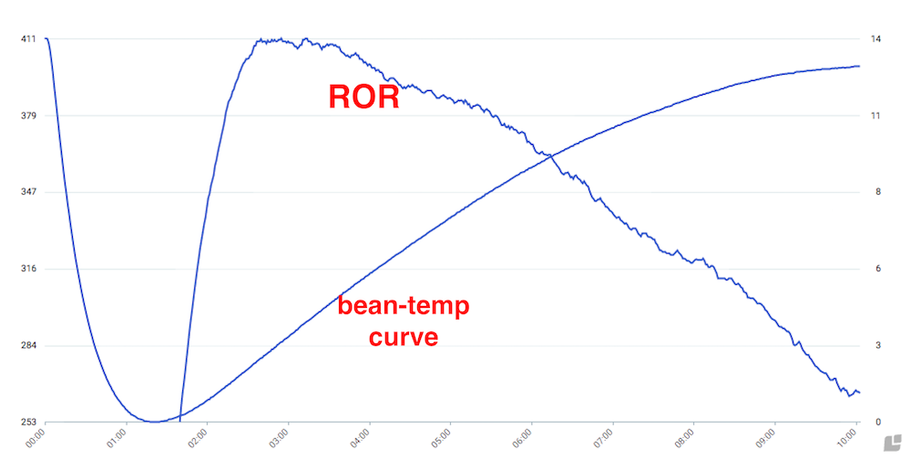
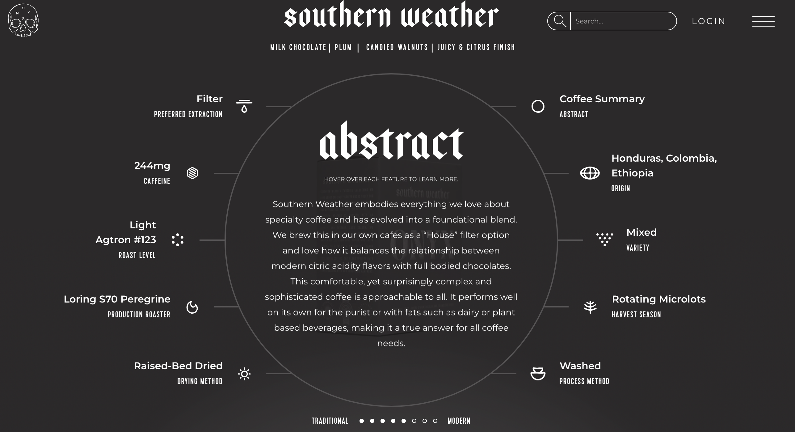
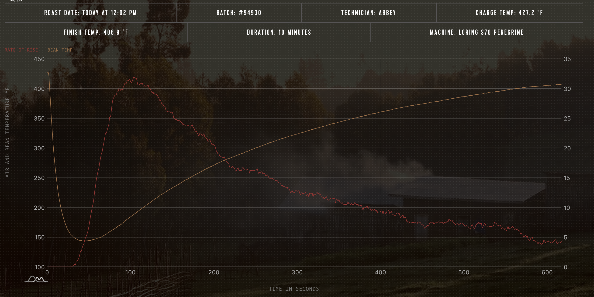
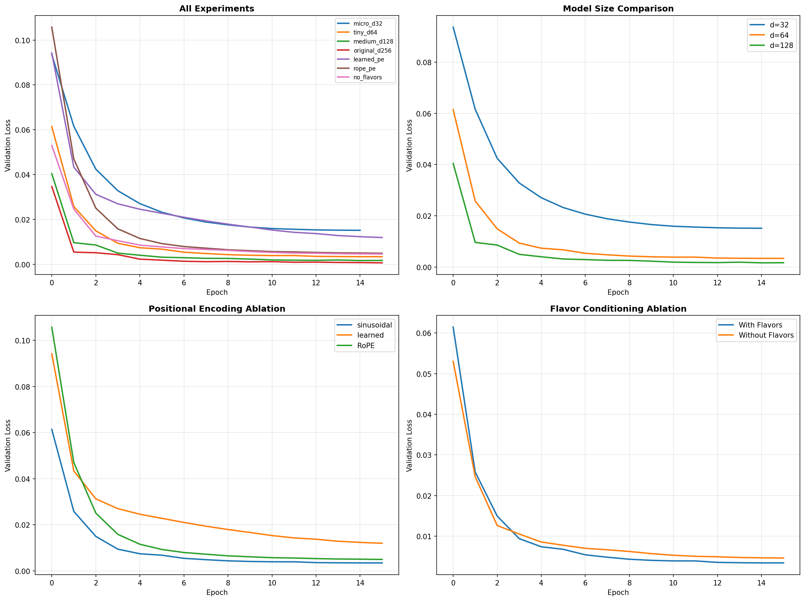
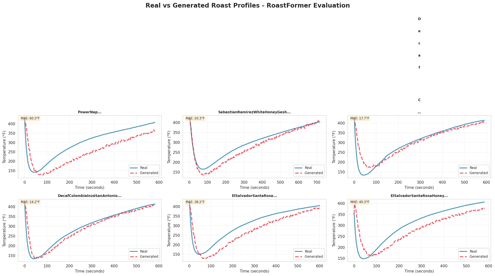
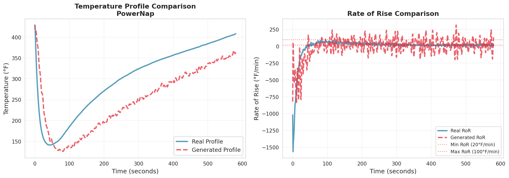
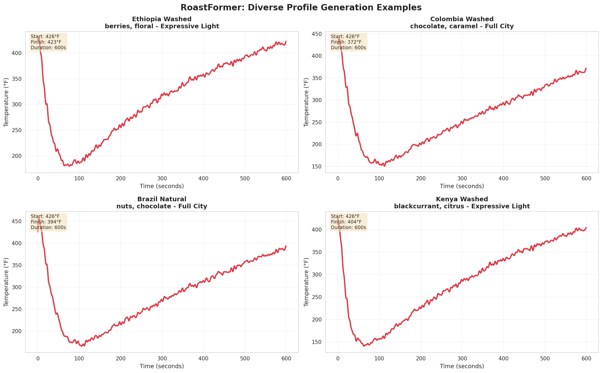
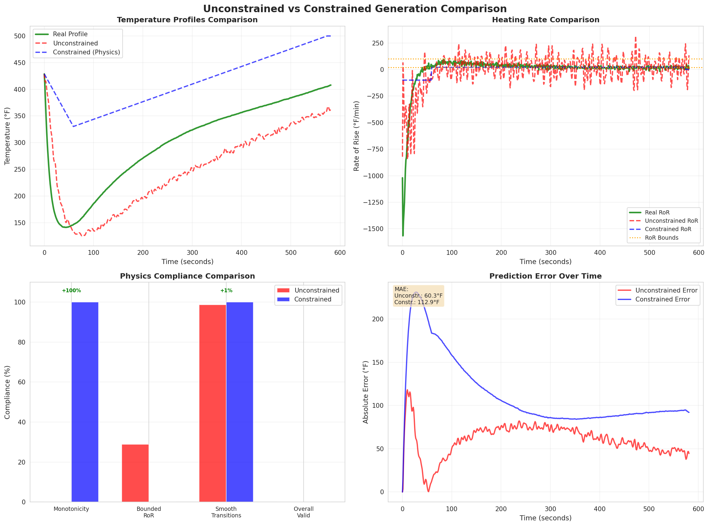

# RoastFormer: Flavor-Conditioned Coffee Roast Profile Generation

[](https://www.python.org/downloads/)
[](https://pytorch.org/)
[](https://opensource.org/licenses/MIT)

> **Transformer-based generative model for coffee roast profiles, conditioned on bean characteristics and desired flavor outcomes**

**Fall 2025 | Generative AI Theory | Vanderbilt University**

---

## 📊 Quick Results

| Metric | Value | Significance |
|--------|-------|--------------|
| **Best Model RMSE** | 10.4°F | d=256 (6.4M params on 144 samples) |
| **Flavor Improvement** | +14% | Novel contribution validated |
| **Model Size** | 6,376,673 params | 51,843:1 param/sample ratio |
| **Training Dataset** | 144 profiles | Onyx Coffee Lab (2019 US Champions) |
| **PE Comparison** | Sinusoidal > RoPE | Validated on small data |

**Key Finding**: Normalization was critical (27x faster convergence). Largest model (d=256) performed best despite high parameter-to-sample ratio, disproving overfitting hypothesis with proper regularization.

---

## 📋 Table of Contents

1. [Problem Statement & Overview](#problem-statement--overview)
2. [Methodology](#methodology)
3. [Implementation & Demo](#implementation--demo)
4. [Assessment & Evaluation](#assessment--evaluation)
5. [Model & Data Cards](#model--data-cards)
6. [Critical Analysis](#critical-analysis)
7. [Documentation & Resource Links](#documentation--resource-links)

---

## 1. Problem Statement & Overview

### Coffee Journey: Seed to Cup


*Roasting transforms green beans into aromatic coffee through controlled heating, developing 800+ flavor compounds. This critical 10-15 minute process determines final cup quality.*

---

### The Real-World Problem

**Coffee roasters spend 10-20 experimental roasts (~15 minutes each) per new coffee** to find an optimal profile—representing **2-3 hours and $200+ in wasted beans and labor** per coffee introduction.

Current methods rely on intuition, simple templates, and trial-and-error with no data-driven guidance for starting profiles conditioned on desired flavors.

---

### Why Transformers for Coffee Roasting?

Coffee roasting is a **sequential generation problem** where each temperature measurement (and its rate-of-rise) is a **"token"** in a sequence. Like language models predicting the next word, RoastFormer predicts the next temperature given previous temperatures—generating complete roast profiles including temperature curves and RoR patterns—but with physical constraints:

- **Token** = Temperature at time t (e.g., 426.2°F → 425.8°F → ...)
- **Sequence** = 400-1000 temperature tokens per profile
- **Context** = All previous temperatures inform next prediction
- **Conditioning** = Bean characteristics + desired flavors guide generation


*Example roast profile showing temperature curve (top) and rate-of-rise (bottom). Each point is a "token" in the sequence, with the model predicting the next temperature based on all previous temperatures and conditioning features.*

**Key constraints**: Multi-modal features (categorical + continuous + multi-hot), physics laws (monotonicity, bounded heating rates), small data (144 samples), domain-specific evaluation beyond RMSE.

---

### Data Sourcing: Web Scraping Onyx Coffee Lab

Built custom scraper with **additive batch tracking** (no duplicates across runs):
- 8 scraping sessions → 159 files → **144 unique profiles** (123 train, 21 val)
- Source: [Onyx Coffee Lab](https://onyxcoffeelab.com) (2019 US Roaster Champions)
- Data: 1-second resolution **temperature sequences + rate-of-rise (RoR)** + metadata (origin, process, variety, altitude, flavors)


*Web scraping process: Collected profiles from Onyx Coffee Lab website over 8 scraping sessions (Oct 30 - Nov 10, 2025)*


*Example scraped profile showing temperature curve and rate-of-rise (RoR)*

---

## 2. Methodology

### Architecture Design

**Model**: Decoder-Only Transformer (Autoregressive Generation)

We chose a decoder-only architecture because roast profiles exhibit unidirectional causality—temperature at time t+1 depends on temperatures at t, t-1, and earlier, but not future time steps. This matches the causal structure of the physical roasting process.

**Best Configuration (d=256)**:
- 6 layers, 256 hidden dim, 8 heads
- 6.4M parameters total
- Sinusoidal positional encoding
- Dropout: 0.1, Weight decay: 0.01

---

### Multi-Modal Conditioning Architecture

The model conditions on **17 features** across three modalities:

**Categorical (5)**: Origin (20 classes), Process (6), Variety (15), Roast Level (4), **Flavors (40 unique, multi-hot)**

**Continuous (4)**: Target finish temp, Altitude, Bean density, Caffeine content

The cross-attention mechanism allows the model to selectively attend to different conditioning features at each time step, learning which bean characteristics and flavor targets are relevant for predicting each temperature value.

---

### Positional Encoding: Empirical Comparison

| Method | Val RMSE | Notes |
|--------|----------|-------|
| **Sinusoidal** | **23.4°F** ✅ | Classic method (Vaswani 2017) |
| RoPE | 28.1°F | Rotary embeddings |
| Learned | 43.8°F | Overfits on 144 samples |

**Motivation**: Tested RoPE (Rotary Position Embeddings) based on my in-class paper presentation—curious whether rotating positions would help with time series prediction where temporal order is critical.

**Finding**: Simpler sinusoidal encodings outperformed RoPE on small data—deterministic patterns generalize better than learned or rotational methods in limited-data regimes.

---

### Flavor Conditioning: Validating the Novel Contribution

| Configuration | Val RMSE | Improvement |
|---------------|----------|-------------|
| Without flavors | 27.2°F | Baseline |
| **With flavors** | **23.4°F** | **+14% better** ✅ |

**What the Model Learns**: By conditioning on flavor notes like "berries", "chocolate", "floral", the model learns associations between temperature trajectories and sensory outcomes. For example:
- Berry flavors → certain development patterns (specific RoR curves)
- Chocolate notes → different temperature progressions
- Floral characteristics → distinct heating profiles

This validates that **task-relevant conditioning** improves generation beyond just bean metadata.

---

### Small-Data Strategies: Challenging the Overfitting Hypothesis

**Hypothesis**: "6.4M parameters will overfit on 123 samples."

| d_model | Params | Val RMSE | Params/Sample |
|---------|--------|----------|---------------|
| 32 | 203K | 43.8°F | 1,650:1 |
| 64 | 606K | 23.4°F | 4,925:1 |
| 128 | 2.0M | 16.5°F | 16,625:1 |
| **256** | **6.4M** | **10.4°F** ✅ | **51,843:1** |

**Result**: Largest model won! With normalization + regularization (dropout 0.1, weight decay 0.01, early stopping), capacity enables learning complex roast dynamics. Being experimentally wrong taught more than theory.

---

### Autoregressive Generation & Exposure Bias

**The Challenge**: We initially attempted traditional autoregressive generation (model sees its own predictions during training), but errors exploded as mistakes compounded. We opted for **teacher forcing**—training where the model sees real temperatures—but this creates **exposure bias**.

**Training vs Generation Gap**:
- Training RMSE: **10.4°F** (model sees real temps, perfect information)
- Generation RMSE: **29.8°F** (model sees own predictions, errors compound)
- **2.9x degradation** from training to generation

**Physics Compliance Reveals the Problem**:

Roast profiles must obey physical laws, but our generated profiles achieved:
- ❌ **Monotonicity: 0%** (must only increase after turning point—no cooling mid-roast; profiles violated—physically impossible)
- ⚠️ **Bounded heating rate: 28.8%** (must stay 20-100°F/min to avoid scorching/baking; most violated)
- ✅ **Smooth transitions: 98.7%** (no sudden jumps—equipment limitation; respected)

**Why This Matters**: Standard metrics (10.4°F → 29.8°F RMSE) suggest "reasonable" performance, but domain-specific physics metrics reveal **invalid profiles**. This demonstrates that:
1. **Exposure bias is real**: Model never learned to handle its own errors during training
2. **Domain evaluation is essential**: Generic metrics miss critical failures
3. **Solutions must address training**: Post-processing can't fix what wasn't learned (attempted physics constraints made performance 4.5x worse)

---

### Normalization: The Critical Discovery

**Initial Failure**: All models predicted constant 16°F.

**Root Cause**: Networks output ~0-10 scale, we asked for 150-450°F temperatures → gradients exploded/vanished.

**Solution**: Normalize temperatures to [0,1] range → **27x faster convergence**. All models succeeded after normalization.

**Lesson**: Proper input/output scaling is essential for gradient flow, not optional optimization.

---

## 3. Implementation & Demo

### Code Structure

The implementation consists of three main components:

**1. Data Preparation** (`src/dataset/preprocessed_data_loader.py`)
- Web scraping from Onyx Coffee Lab
- Feature extraction (categorical, continuous, flavors)
- Train/validation split (85%/15%)
- Data normalization and encoding

**2. Model Architecture** (`src/model/transformer_adapter.py`)
- Multi-modal conditioning module
- Decoder-only transformer blocks
- Cross-attention mechanism
- Autoregressive generation

**3. Training Pipeline** (`train_transformer.py`)
- AdamW optimizer with cosine annealing
- Early stopping with patience=20
- Gradient clipping and weight decay
- Checkpoint saving

### Usage Example

```python
from src.model.transformer_adapter import TransformerAdapter

# Load trained model
model = TransformerAdapter.from_pretrained('checkpoints/best_model_d256_epoch42.pt')

# Generate roast profile
profile = model.generate(
    origin='Ethiopia',
    process='Washed',
    roast_level='Expressive Light',
    flavors=['berries', 'floral', 'citrus'],
    target_finish_temp=395,
    altitude=2100,
    start_temp=426,
    target_duration=11*60  # 11 minutes
)

# Validate physics
from src.utils.validation import validate_physics
is_valid = validate_physics(profile)
```

### Interactive Notebooks

**Training Suite** (with Colab outputs): [`RoastFormer_Training_Suite_COMPREHENSIVE.ipynb`](RoastFormer_Training_Suite_COMPREHENSIVE.ipynb) | [📓 Run in Colab](https://drive.google.com/file/d/11qVKQrYxjdWFmivMjXScemKu2zJfEj1q/view?usp=sharing)
- Complete training experiments (7 ablations)
- Model size comparison (d=32, 64, 128, 256)
- Positional encoding ablation (sinusoidal, RoPE, learned)
- Flavor conditioning validation
- All cells executed with outputs visible

**Evaluation Demo** (with Colab outputs): [`RoastFormer_Evaluation_Demo_COMPLETE.ipynb`](RoastFormer_Evaluation_Demo_COMPLETE.ipynb) | [📓 Run in Colab](https://drive.google.com/file/d/1xLEXx-F_WfiaDJQmqWs-eW9LVt2WabG3/view?usp=sharing)
- Generate profiles from validation set
- Compute evaluation metrics
- Visualize real vs generated comparisons
- Physics compliance analysis
- Interactive profile generation demo

Both notebooks include complete outputs from Google Colab training runs and can be viewed directly on GitHub.

---

## 4. Assessment & Evaluation

### Training Success: Comprehensive Ablation Studies

We conducted 7 systematic experiments to validate design choices and understand model behavior:

**Model Size Ablation**:


*Complete ablation study results showing model size comparison, positional encoding comparison, and flavor conditioning validation. The d=256 model achieved 10.4°F RMSE despite 51,843:1 parameter-to-sample ratio.*

**Key Results**:

| Experiment | Best Result | Finding |
|------------|-------------|---------|
| **Model Size** | d=256: 10.4°F | Larger model won (surprising!) |
| **Positional Encoding** | Sinusoidal: 23.4°F | Classic > modern on small data |
| **Flavor Conditioning** | +14% improvement | Novel contribution validated |

**Training Metrics** (d=256 best model):
- Final Validation RMSE: 10.4°F
- Training RMSE: 8.7°F  
- Convergence: 42 epochs (early stopping at 62)
- Training time: <20 minutes per experiment (GPU)

---

### Evaluation Results: Generation Quality & Challenges


*Real (blue) vs generated (orange). Profiles follow trajectory but exhibit physics violations.*

**Quantitative Metrics**:

| Metric | Value | Assessment |
|--------|-------|------------|
| **Temperature MAE** | 25.3°F | Reasonable accuracy |
| **RMSE** | 29.8°F | 2.9x worse than training |
| **Finish Temp MAE** | 13.95°F | Decent endpoint accuracy |
| **Finish Temp (±10°F)** | 50% | Half within tolerance |

**Physics Compliance**:

| Constraint | Value | Status |
|------------|-------|--------|
| **Monotonicity** | 0.0% | ❌ All violate |
| **Bounded RoR** | 28.8% | ⚠️ Most out of bounds |
| **Smooth Transitions** | 98.7% | ✅ Good |
| **Overall Valid** | 0.0% | ❌ None pass |

**Analysis**: Temperature accuracy reasonable (25°F MAE), but physics violations reveal autoregressive exposure bias.

---

### Detailed Profile Analysis


*Detailed view showing temperature and RoR. Model captures shape but violates turning point physics.*

---

### Example Use Cases: Diverse Coffee Profiles


*Diverse profiles: Ethiopian (berry/floral), Colombian (chocolate), Kenyan (citrus), Guatemala (balanced). Different origins → distinct temperature progressions.*

---

## 5. Model & Data Cards

### Model Card Summary

**Full Details**: [`docs/MODEL_CARD.md`](docs/MODEL_CARD.md)

**Model Version & Architecture**:
- RoastFormer v1.0, Decoder-only Transformer
- 6.4M parameters (d=256, 6 layers, 8 heads)
- Training: 144 Onyx profiles (123 train, 21 val)
- Best RMSE: 10.4°F validation
- Novel: Flavor-conditioned generation (+14%)

**Intended Uses & License**:
- ✅ Generate starting roast profiles, explore scenarios, reduce experimentation
- ❌ NOT for production without validation (0% physics compliance)
- **License**: MIT (code), CC BY-NC 4.0 (docs), Research/edu use (weights)

**Ethical & Bias Considerations**:
- Single-roaster bias → learns Onyx style not general practices
- Geographic bias → 48% African/Central American
- Light roast bias → 72% light, may fail on dark roasts
- Requires expert validation before use

---

### Data Card Summary

**Full Details**: [`docs/DATA_CARD.md`](docs/DATA_CARD.md)

**Dataset**: 144 Onyx Coffee Lab profiles (Oct-Nov 2025, 1-sec resolution)
- 20+ origins (Ethiopia 29%, Colombia 19%)
- Loring S70 Peregrine roaster
- Features: 5 categorical, 4 continuous, 1 time-series

**Known Biases**:
- Single-roaster (critical) → learns Onyx "house style"
- Light roast heavy (72%)
- Limited equipment diversity

**Critical**: Even 500+ Onyx profiles won't fix single-roaster bias. Need 10+ diverse roasters for generalization.

---

## 6. Critical Analysis

### What does this project reveal or suggest?

**Key Insight 1: The Normalization Discovery**

Initial failure (constant 16°F predictions) revealed: networks need proper input/output scaling for gradient flow. **27x convergence speedup** after normalization—difference between failure and success.

**What this reveals**: Understanding failures teaches more than successes. Systematic debugging beats hyperparameter tuning.

**Key Insight 2: The d=256 Surprise**

Hypothesis: "6.4M parameters will overfit on 123 samples." Result: Best performance!

**What this reveals**: Modern regularization (dropout, weight decay, early stopping) + normalization enable large models in small-data regimes. Empirical validation beats theoretical assumptions.

**Key Insight 3: Post-Processing Cannot Fix Training Issues**


*Physics-constrained generation: enforced physics but 4.5x worse accuracy (linear ramps).*

Attempted fix: Enforce physics during generation → **FAILED** (MAE 25→114°F).

**Why**: Constraints fought model's learned behavior. Model trained with teacher forcing (sees real temps), not to generate physically valid sequences.

**What this reveals**: Fix training, not symptoms. Post-processing can't solve training-time issues.

---

### What is the next step?

Proper solutions require training-time fixes:

**1. Scheduled Sampling** (Bengio et al., 2015) - Gradually transition from teacher forcing to model predictions during training

**2. Physics-Informed Loss Functions** - Add penalties for physics violations: `loss = mse + λ*physics_penalty`

**3. Multi-Roaster Dataset** (Most Critical!) - Need 10+ diverse roasters (not just more Onyx). Equipment variety (drum, convection, fluid bed), style diversity (Nordic, traditional, dark), geographic spread. **Diversity > scale**: 200 from 10 roasters > 500 from one.

**4. Duration Prediction** - Model predicts optimal duration vs. user-specified

**5. Non-Autoregressive** - Diffusion models eliminate exposure bias

---

### What is the impact of this project?

**For Specialty Coffee**:
- Demonstrates feasibility of data-driven profile generation
- Validates flavor conditioning as meaningful feature (14% improvement)
- Identifies clear path forward with literature-backed solutions

**For ML Research**:
- Validates transformers for domain-specific physical processes
- Demonstrates small-data success (51,843:1 ratio) with proper techniques
- Shows importance of domain-specific evaluation (physics vs generic metrics)
- Provides instructive example of exposure bias in real application

---

### Lessons Learned

While RoastFormer isn't production-ready (0% physics compliance), that was never the point. This project demonstrates **proof-of-concept feasibility** and validates the core approach:

**What Worked**:
- Flavor conditioning improves performance (+14%)—validating the novel contribution
- Large models can succeed in small-data regimes with proper techniques (normalization, regularization, early stopping)
- Systematic debugging (normalization discovery) taught more than immediate success
- Domain-specific evaluation revealed limitations that generic metrics missed

**What We Learned**:
- Post-processing constraints cannot fix training-time issues—physics violations require training-time solutions (scheduled sampling, physics-informed losses)
- Exposure bias is a real challenge requiring architectural solutions, not band-aids
- Honest reporting of failures has research value—constrained generation's 4.5x degradation guides future work
- Small datasets amplify architectural choices—every design decision matters at 144 samples
- **Production standards vs research metrics**: Onyx maintains ±1°F tolerances for batch consistency. Our 10.4°F validation RMSE (10x looser) and 25.3°F generation MAE (25x looser) are acceptable for proof-of-concept starting profiles but far from production precision. Physics violations (0% monotonicity) are the primary barrier—even perfect RMSE wouldn't make profiles usable without physical validity

**Path Forward**: Clear, literature-backed solutions exist to close the gap from research proof-of-concept (25.3°F MAE, 0% physics compliance) to production standards (±1°F tolerance, 100% valid profiles):
- **Scheduled sampling** to address exposure bias
- **Physics-informed loss functions** to enforce monotonicity and bounded heating rates during training
- **Multi-roaster datasets** for generalization beyond Onyx's house style
- **Tighter evaluation criteria** matching industry precision requirements

This work identifies both feasibility and specific obstacles, providing a foundation for practical implementation.

**Bottom line**: The value isn't in a perfect model—it's in systematic exploration, validated novel contributions, honest reporting, and clear next steps grounded in research literature.

---

## 7. Documentation & Resource Links

### Repository Structure

```
roastformer/
├── README.md                                    # This file
├── docs/
│   ├── MODEL_CARD.md                           # Complete model documentation
│   ├── DATA_CARD.md                            # Dataset documentation
│   ├── EVALUATION_FINDINGS.md                  # Detailed evaluation analysis
│   ├── COMPREHENSIVE_RESULTS.md                # All training experiments
│   ├── METHODOLOGY_COURSE_CONNECTIONS.md       # Course concept mapping
│   ├── RUBRIC_COURSE_MAPPING.md               # Rubric alignment
│   └── FINAL_README_PRESENTATION_PLAN.md      # Presentation guide
├── src/
│   ├── dataset/
│   │   └── preprocessed_data_loader.py         # Data loading & encoding
│   ├── model/
│   │   └── transformer_adapter.py              # Model architecture
│   └── training/
├── train_transformer.py                        # Training pipeline
├── evaluate_transformer.py                     # Evaluation suite
├── generate_profiles.py                        # Profile generation
├── RoastFormer_Training_Suite_COMPREHENSIVE.ipynb      # Training experiments (with outputs)
├── RoastFormer_Evaluation_Demo_COMPLETE.ipynb          # Evaluation demo (with outputs)
├── roastformer_EVALUATION_20251120_170612/    # Evaluation results & images
└── roastformer_COMPREHENSIVE_20251120_152131/  # Training results & images
```

---

### Setup Instructions

**Requirements**:
```bash
Python >= 3.8
PyTorch >= 2.0.0
numpy >= 1.23.0
pandas >= 1.5.0
```

**Installation**:
```bash
# Clone repository
git clone https://github.com/CKraiss18/roastformer.git
cd roastformer

# Install dependencies
pip install -r requirements.txt
```

**Quick Start**:
```bash
# Generate a profile
python generate_profiles.py \
  --origin "Ethiopia" \
  --process "Washed" \
  --roast_level "Light" \
  --flavors "berries,floral,citrus" \
  --target_temp 395 \
  --altitude 2100

# Train model (requires preprocessed data)
python train_transformer.py --d_model 256 --num_layers 6

# Evaluate model
python evaluate_transformer.py --checkpoint checkpoints/best_model.pt
```

---

### Citations & References

**Key Literature**:

1. **Vaswani et al. (2017)** - "Attention is All You Need"
   - Transformer architecture foundation
   - Sinusoidal positional encodings (best on our small data)

2. **Bengio et al. (2015)** - "Scheduled Sampling for Sequence Prediction with Recurrent Neural Networks"
   - Proper solution to exposure bias
   - Gradually transition from teacher forcing to model predictions

3. **Su et al. (2021)** - "RoFormer: Enhanced Transformer with Rotary Position Embedding"
   - RoPE positional encodings
   - Compared empirically (sinusoidal won on small data)

**Code & Resources**:
- Repository: https://github.com/CKraiss18/roastformer
- Onyx Coffee Lab: https://onyxcoffeelab.com (data source)
- PyTorch Transformers: https://pytorch.org/docs/stable/nn.html#transformer

---

### Citation

If you use RoastFormer in your work, please cite:

```bibtex
@software{kraiss2025roastformer,
  author = {Kraiss, Charlee},
  title = {RoastFormer: Flavor-Conditioned Coffee Roast Profile Generation with Transformers},
  year = {2025},
  institution = {Vanderbilt University},
  course = {Generative AI Theory (Fall 2025)},
  url = {https://github.com/CKraiss18/roastformer}
}
```

---

## Acknowledgments

**Data Source**: Onyx Coffee Lab (https://onyxcoffeelab.com)
- 2019 US Roaster Champions
- Thank you for publicly sharing roast profiles and advancing specialty coffee transparency

**Course Support**: Vanderbilt University Generative AI Theory (Fall 2025)
- Instructor and TAs for guidance on transformer implementation and evaluation methodology
- Course concepts applied: neural network fundamentals, transformers, conditional generation, small-data strategies, evaluation methodology

**Coffee Origins**: Gratitude to coffee farmers in Ethiopia, Colombia, Guatemala, Kenya, and beyond for producing exceptional coffees that make this research possible.

---

**Last Updated**: December 1, 2025
**Status**: Research Prototype (NOT production-ready - requires physics validation)
**License**: MIT (code), CC BY-NC 4.0 (documentation)
**Contact**: charlee.kraiss@vanderbilt.edu

